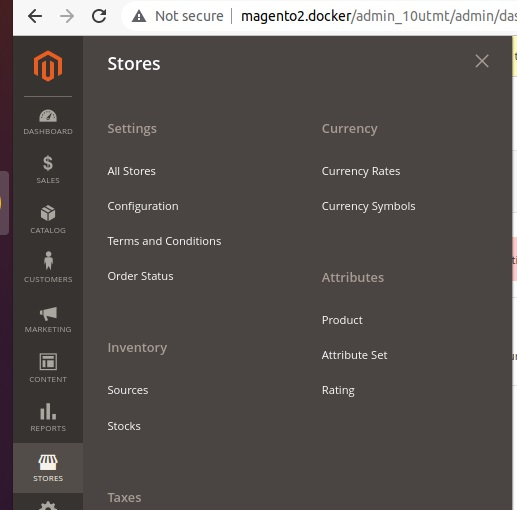
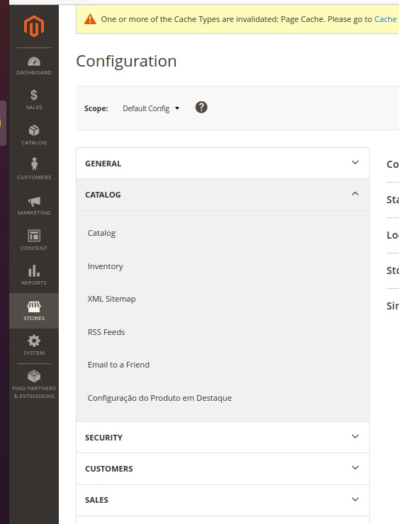
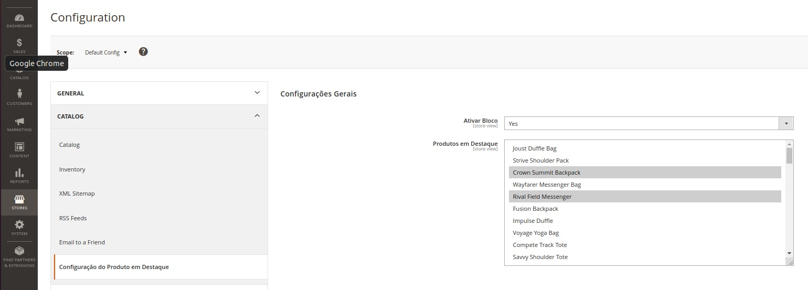

# Módulo Magento para Carousel de produtos

Este repositório contém um módulo para Magento2 exibir um Carousel de produtos na página inicial do tema Luma.

Configurado por padrão com produtos do Magento Sample Data.


## Índice

- [Pré-requisitos](#pré-requisitos)
- [Instalação](#instalação)
- [Uso Básico](#uso-básico)

## Pré-requisitos

Antes de começar, certifique-se de ter instalado:

- PHP (~8.2.1)
- Composer (~2.6.6)
- Magento2 (~2.4.6)

## Instalação

Para instalar este modulo no Magento, siga os passos abaixo na raiz do Magento2:

```bash
composer require 00f100/producthome
```

## Uso Básico

Abrir Store > Configuration



Abrir Catalog > Configuração do Produto em Destaque



Ativar/Desativar e selecionar os produtos a serem exibidos


